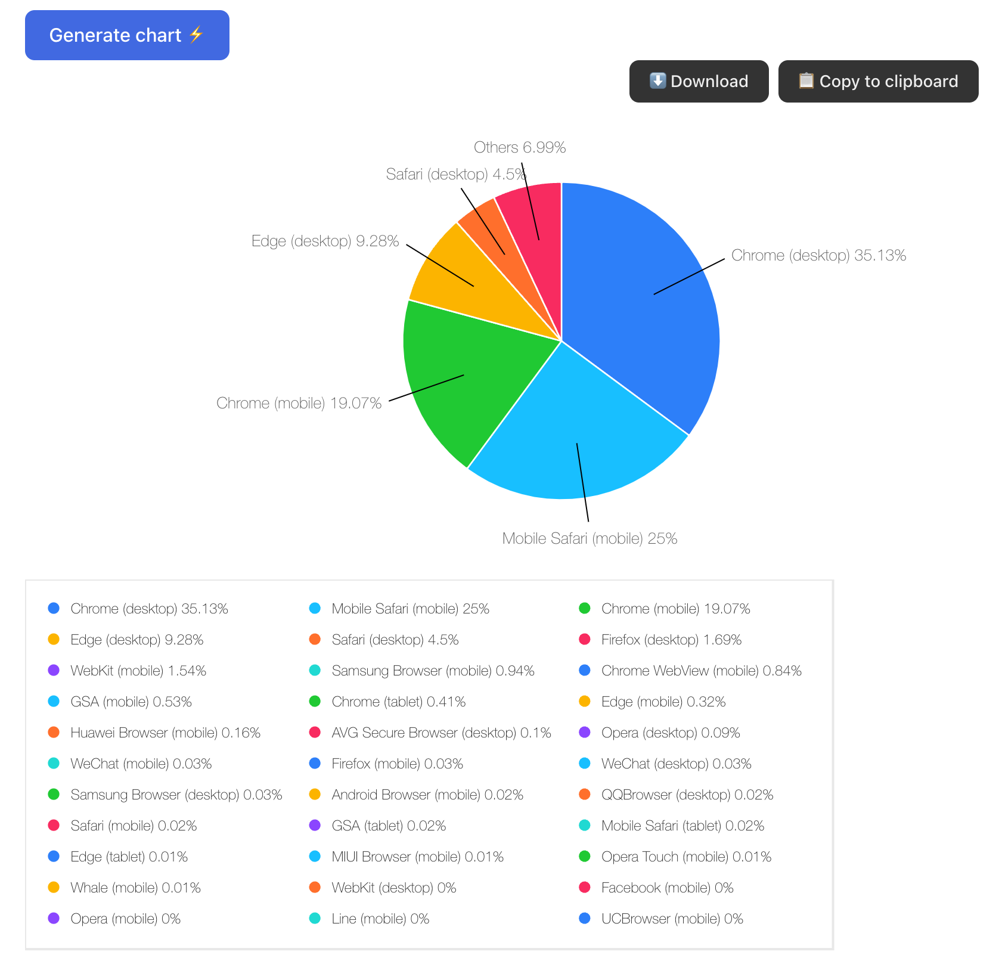

# CSV to Pie Chart

Paste your CSV and generate a pie chart! Only one configuration option:

- choose the max number of segments to show

Features

- copy to clipboard
- download generated image

## Tech stack

- [Vite React + Typescript + SWC](https://vite.dev/)
- [Victory Charts](https://commerce.nearform.com/open-source/victory/)
- [csvtojson](https://www.npmjs.com/package/csvtojson)
- [html2canvas](https://www.npmjs.com/package/html2canvas/v/1.4.1)